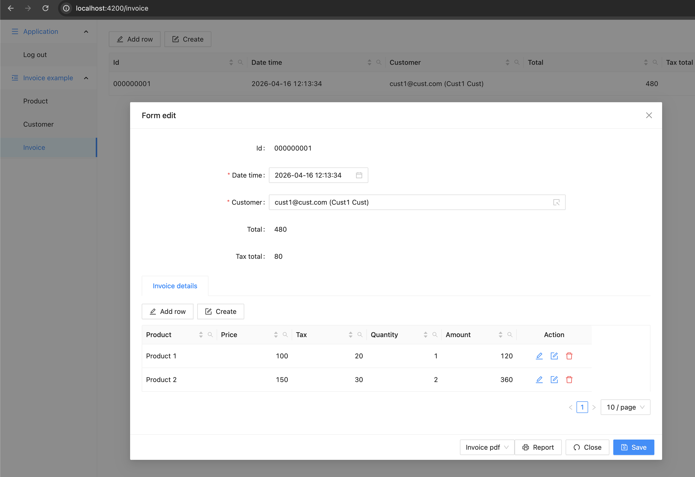
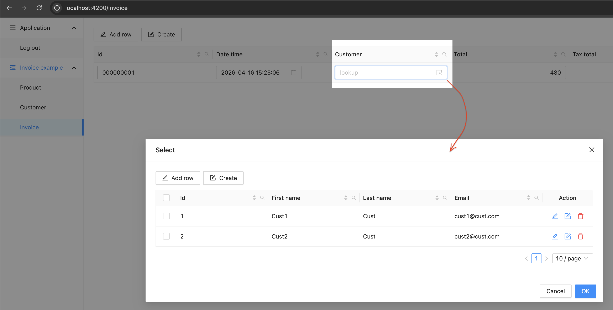
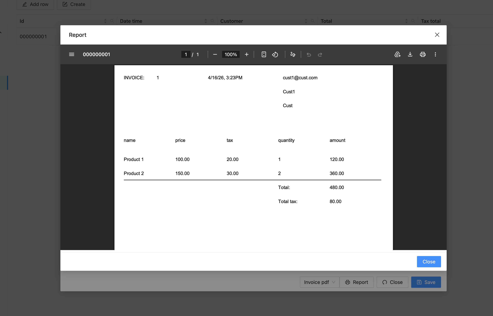
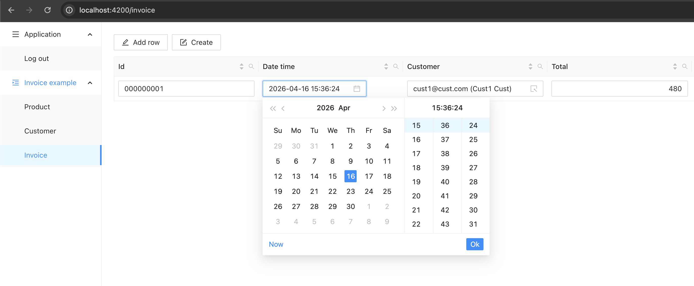

# Metadata-Driven Web UI for Business Data Management

> Metadata-driven web UI for business data management.  
> A dynamic frontend that adapts to backend-provided metadata, allowing new business functionality to be delivered without frontend changes.

---

## ✨ Overview

**Experiment UI** is a metadata-driven frontend platform for managing business data.

The UI dynamically renders pages, forms, and tables based on backend metadata definitions. This allows rapid delivery of new business features by modifying only the backend.

Key principles:
- No hardcoded forms or tables
- Schema-driven UI generation
- Backend-first extensibility

---

## 🖼️ UI Preview

Support for data editing in table and form views with flexible master–detail support for multiple details.


Support for lookup fields (selectable from a predefined list)


Support for PDF reports


Support for calendar and other data types


---

## 🧱 Architecture

- Frontend: Angular + Ant Design
- Backend: Spring Boot
- API style: REST (metadata + generic CRUD)
- UI model: Schema-driven rendering

---

## 🚀 Features

- Dynamic UI generation from metadata
- Generic CRUD operations for business entities
- Configurable backend API endpoint
- Extensible architecture for enterprise use cases
- Strong separation between UI and business logic

---

## 📦 Backend

This project requires a backend service:

👉 https://github.com/sdbrother0/srv

The backend provides:
- entity metadata definitions
- schema descriptions
- generic data access API

---

## 🖥️ Getting Started

### 1. Clone repository

### 2. Change API_URL:

change API_URL in file: [config.json](src/assets/config.json) (src/assets/config.json) to your host
(e.g.: `http://localhost:8090` -> `https://sdbrother.org/api`)
```
{
  "API_URL": "https://sdbrother.org/api"
}
```

### 3. Stop backend server (if running) and Build prod UI
```
ng build --c=production ui-ng-ant
```

### 4. Copy files to /var/www/html/ (nginx)
```
cp -r ./dist/ui-ng-ant/browser/* /var/www/html/
ln -s /var/www/html/index.csr.html /var/www/html/index.html
```

### 5. Nginx settings in file /etc/nginx/sites-available/default
```
upstream backend8090 {
    server localhost:8090;
}

server {
    listen 80 default_server;
    server_name _;
    return 301 https://$host$request_uri;
}

server {
    listen 443 ssl default_server;
    listen [::]:443 ssl default_server;

    ssl_certificate /etc/ssl/certificate.crt;
    ssl_certificate_key /etc/ssl/certificate.key;
    ssl_session_timeout 5m;
    ssl_protocols TLSv1 TLSv1.1 TLSv1.2;

    root /var/www/html;
    index index.html;

    server_name _;

    location / {
        try_files $uri $uri/ =404;
        error_page 404 =200 /index.html;
    }

    location /api/ {
        proxy_http_version 1.1;
        proxy_set_header Upgrade $http_upgrade;
        proxy_set_header Connection "Upgrade";
        proxy_set_header Host $host;
        proxy_pass http://backend8090/;
    }
}
```
