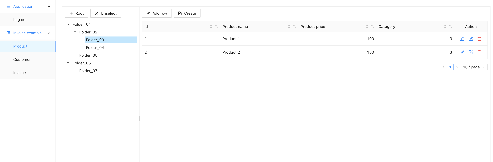

# Metadata-Driven Web UI for Business Data Management

> Metadata-driven web UI for business data management.  
> A dynamic frontend that adapts to backend-provided metadata, allowing new business functionality to be delivered without frontend changes.

---

## ✨ Overview

**Experiment UI** is a metadata-driven frontend platform for managing business data.

The UI dynamically renders pages, forms, and tables based on backend metadata definitions. This allows rapid delivery of new business features by modifying only the backend.

Key principles:
- No hardcoded forms or tables
- Schema-driven UI generation
- Backend-first extensibility

---

## 🖼️ UI Preview

#### Support for data editing in table and form views with flexible master–detail support for multiple details.

#### Support for lookup fields (selectable from table)

#### Support for PDF reports

#### Support for calendar and other data types

#### Support for hierarchical trees (editable) placed to the left of the table, filtering table data by the selected node


---

## 📦 Examples metadata received from the backend

Metadata for Invoice
```json
{
  "url": "/invoice",
  "name": "invoice",
  "key": "id",
  "fields": [
    {
      "name": "id",
      "label": "Id",
      "type": {
        "name": "string"
      },
      "hidden": false
    },
    {
      "name": "created",
      "label": "Date time",
      "type": {
        "name": "date",
        "format": "yyyy-MM-dd HH:mm:ss"
      },
      "editable": true,
      "validation": {
        "required": true,
        "message": "Input date please!!!"
      }
    },
    {
      "name": "customer",
      "label": "Customer",
      "type": {
        "name": "lookup",
        "metaUrl": "/meta/customer",
        "foreignKey": "customer_id",
        "valFieldName": "name",
        "keyFieldName": "id"
      },
      "editable": true,
      "validation": {
        "required": true,
        "message": "Select customer please!!!"
      }
    },
    {
      "name": "total",
      "label": "Total",
      "type": {
        "name": "number"
      },
      "editable": false
    },
    {
      "name": "taxTotal",
      "label": "Tax total",
      "type": {
        "name": "number"
      },
      "editable": false
    }
  ],
  "details": [
    {
      "label": "Invoice details",
      "metaUrl": "/meta/invoice_product_details",
      "masterObjectName": null,
      "masterFieldKey": null
    }
  ],
  "reports": [
    {
      "label": "Invoice pdf",
      "url": "/reports/invoice"
    }
  ]
}
```

Metadata for Invoice Details

```json
{
  "url": "/invoice_product_details",
  "name": "invoice_product_details",
  "key": "id",
  "fields": [
    {
      "name": "id",
      "label": "Invoice product details id",
      "type": {
        "name": "string"
      },
      "hidden": true
    },
    {
      "name": "product",
      "label": "Product",
      "type": {
        "name": "lookup",
        "metaUrl": "/meta/product",
        "foreignKey": "product_id",
        "valFieldName": "name",
        "keyFieldName": "id",
        "masterMapping": {
          "price": "price",
          "tax": "tax",
          "quantity": "1"
        }
      },
      "editable": true,
      "validation": {
        "required": true,
        "message": "Select product please!!!"
      }
    },
    {
      "name": "price",
      "label": "Price",
      "type": {
        "name": "number"
      },
      "editable": true,
      "validation": {
        "required": true,
        "message": "Input price please!!!"
      }
    },
    {
      "name": "tax",
      "label": "Tax",
      "type": {
        "name": "number"
      },
      "editable": true,
      "validation": {
        "required": true,
        "message": "Input tax please!!!"
      }
    },
    {
      "name": "quantity",
      "label": "Quantity",
      "type": {
        "name": "number"
      },
      "editable": true,
      "validation": {
        "required": true,
        "message": "Input quantity please!!!"
      }
    },
    {
      "name": "amount",
      "label": "Amount",
      "type": {
        "name": "number"
      },
      "editable": false
    }
  ],
  "tree": {
    "url": "/category/tree",
    "keyFieldName": "id",
    "titleFieldName": "name",
    "parentFieldName": "parentId",
    "fkFieldName": "category"
  }
}
```

Metadata with a tree

When a `tree` block is present in the metadata, an editable tree is rendered to the left of the table (inside a draggable splitter). Selecting a node re-requests the table data filtered by that node, and new rows are automatically linked to the selected node via `fkFieldName`. The tree is loaded from `url` as a flat list of nodes; the hierarchy is built on the client from `parentFieldName`.

```json
{
  "url": "/product",
  "name": "product",
  "key": "id",
  "fields": [
    {
      "name": "id",
      "label": "Id",
      "type": {
        "name": "string"
      },
      "hidden": true
    },
    {
      "name": "name",
      "label": "Name",
      "type": {
        "name": "string"
      },
      "editable": true
    }
  ],
  "tree": {
    "url": "/category/tree",
    "keyFieldName": "id",
    "titleFieldName": "name",
    "parentFieldName": "parentId",
    "fkFieldName": "category"
  }
}
```

Tree CRUD uses the same conventions as tables:

- `GET {tree.url}` — returns the flat list of nodes (`[...]` or `{ "content": [...] }`)
- `POST {tree.url}` — creates or updates a node `{ [keyFieldName]?, [titleFieldName], [parentFieldName] }`, returns the saved node
- `DELETE {tree.url}?id=<id>` — deletes a node

Example response of `GET /category/tree` (flat list; roots have `parentId: null`)

```json
[
  { "id": 1, "name": "Electronics", "parentId": null },
  { "id": 2, "name": "Phones",      "parentId": 1 },
  { "id": 3, "name": "Smartphones", "parentId": 2 },
  { "id": 4, "name": "Feature phones", "parentId": 2 },
  { "id": 5, "name": "Laptops",     "parentId": 1 },
  { "id": 6, "name": "Clothing",    "parentId": null },
  { "id": 7, "name": "Men",         "parentId": 6 }
]
```

Selecting the "Smartphones" node (`id = 3`) re-requests the table filtered by the foreign key:

```
GET /product?page=0&size=10&search=category=3
```

---

## 🧱 Architecture

- Frontend: Angular + Ant Design
- Backend: Spring Boot
- API style: REST (metadata + generic CRUD)
- UI model: Schema-driven rendering

---

## 🚀 Features

- Dynamic UI generation from metadata
- Generic CRUD operations for business entities
- Editable hierarchical trees that filter the table by the selected node (rows added while a node is selected are automatically assigned to it)
- Configurable backend API endpoint
- Extensible architecture for enterprise use cases
- Strong separation between UI and business logic

---

## 📦 Backend

This project requires a backend service:

👉 https://github.com/sdbrother0/srv

The backend provides:
- entity metadata definitions
- schema descriptions
- generic data access API

---

## 🖥️ Getting Started

### 1. Clone repository

### 2. Change API_URL:

change API_URL in file: [config.json](src/assets/config.json) (src/assets/config.json) to your host
(e.g.: `http://localhost:8090` -> `https://sdbrother.org/api`)
```
{
  "API_URL": "https://sdbrother.org/api"
}
```

### 3. Stop backend server (if running) and Build prod UI
```
ng build --c=production ui-ng-ant
```

### 4. Copy files to /var/www/html/ (nginx)
```
cp -r ./dist/ui-ng-ant/browser/* /var/www/html/
ln -s /var/www/html/index.csr.html /var/www/html/index.html
```

### 5. Nginx settings in file /etc/nginx/sites-available/default
```
upstream backend8090 {
    server localhost:8090;
}

server {
    listen 80 default_server;
    server_name _;
    return 301 https://$host$request_uri;
}

server {
    listen 443 ssl default_server;
    listen [::]:443 ssl default_server;

    ssl_certificate /etc/ssl/certificate.crt;
    ssl_certificate_key /etc/ssl/certificate.key;
    ssl_session_timeout 5m;
    ssl_protocols TLSv1 TLSv1.1 TLSv1.2;

    root /var/www/html;
    index index.html;

    server_name _;

    location / {
        try_files $uri $uri/ =404;
        error_page 404 =200 /index.html;
    }

    location /api/ {
        proxy_http_version 1.1;
        proxy_set_header Upgrade $http_upgrade;
        proxy_set_header Connection "Upgrade";
        proxy_set_header Host $host;
        proxy_pass http://backend8090/;
    }
}
```
